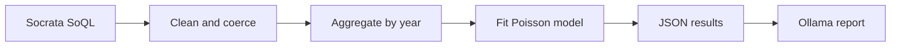
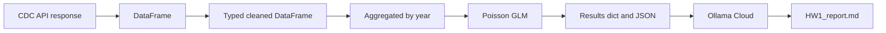

# HW1: Pediatric Suicide Methods Pipeline

## 📌 Overview

This project runs a fixed pipeline that fetches pediatric suicide mortality data from the CDC (Socrata), cleans and aggregates it by year, fits a Poisson regression model, and uses Ollama Cloud to generate a short written report. All steps run from a single script, `HW1.py`.

## ✨ Features

- **Socrata (SoQL) fetch**: Pediatric suicides (age &lt; 15) from CDC injury mortality dataset, grouped by year and injury mechanism.
- **Clean + type coercion**: Pandas-based cleaning and validation (year, total_deaths, sanity checks).
- **Aggregation**: Sum of deaths by year for trend analysis.
- **Poisson regression**: Count model for deaths vs. year (rate ratio per year).
- **Structured results**: JSON results object plus AI-generated interpretation via Ollama Cloud.
- **Quality control**: Step-wise checks and clear error messages so you can see what went wrong.

## 📊 Pipeline Flow



### Data Flow



## ⚙️ Requirements

- Python 3.8+
- `.env` in the **project root** with:
  - `SOCRATA_APP_TOKEN` (CDC Socrata app token)
  - `OLLAMA_API_KEY` (Ollama Cloud API key)

## 📦 Installation

From the project root (or from `03_query_ai/`):

```bash
pip3 install -r 03_query_ai/requirements.txt
```

If `pip3` is not found, try `python3 -m pip install -r 03_query_ai/requirements.txt`.

Or install packages directly:

```bash
pip3 install requests python-dotenv pandas numpy statsmodels
```

## 🚀 Usage

From the **project root**:

```bash
python 03_query_ai/HW1.py
```

Or from inside `03_query_ai/`:

```bash
cd 03_query_ai
python HW1.py
```

The script will write outputs next to `HW1.py` (in `03_query_ai/`).

## 📁 Project Structure

- `HW1.py` – Single script that runs the full pipeline.
- `requirements.txt` – Python dependencies for this pipeline.
- `README.md` – This file.
- `SIMPLE.md` – Short launch instructions and ELI5 explanation.

Outputs (created when you run the script):

- `HW1_results.json` – Summary stats, aggregated data by year, and model coefficients.
- `HW1_report.md` – AI-generated interpretation from Ollama.

## 📊 Output

- **Console**: Progress and the full AI report.
- **HW1_results.json**: `summary_stats`, `aggregated_data` (year and total_deaths), and `model` (coefficient, rate_ratio, p_value).
- **HW1_report.md**: Plain-language interpretation of the trend and findings.
