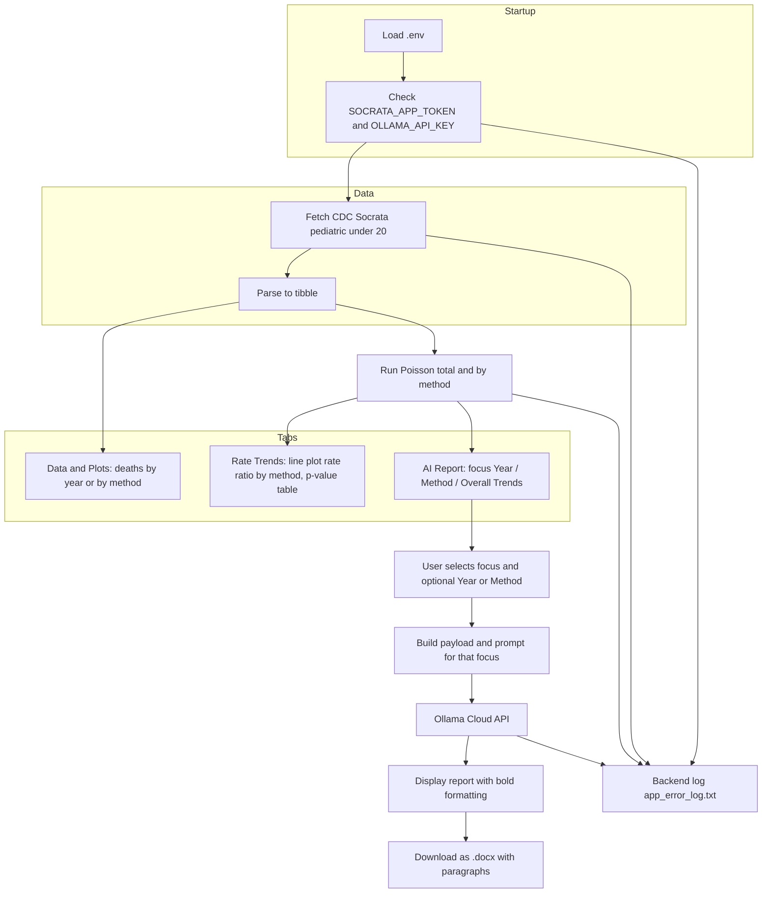

# Pediatric Suicide Methods + Ollama — Shiny App (V2)

## Overview

V2 queries the **CDC injury mortality API** (Socrata) for pediatric suicide (under 20), shows **Data & Plots**, runs **Poisson regression** (rate trends by method), and uses **Ollama Cloud** to generate focused AI reports (**Year**, **Method**, or **Overall Trends**). Reports use only the data provided (no all-ages totals, no emojis), display with bold formatting, and can be downloaded as a **paragraph-formatted .docx**. For the original app, see `app_v1`.

## Project flow



## Features (V2)

- **Data & Plots**: Two cards — deaths by year for a selected injury method; deaths by method for a selected year. Dropdowns populated from the API.
- **Rate Trends (Poisson)**: Line plot (x = method of death, y = rate ratio) with markers; table below with **Method of Death** and **P-value**. Card title: *Trends in Total Deaths Over Time by Method: Rate Ratios and p-Values*.
- **AI Report**:
  - **Report focus** dropdown: **Year**, **Method**, or **Overall Trends** (Poisson).
  - **Year**: Second dropdown to pick the year; report uses breakdown for that year and a single total (sum of breakdown). Prompt forbids all-ages totals and invented numbers.
  - **Method**: Second dropdown to pick injury method; report emphasizes total deaths by method (all years).
  - **Overall Trends**: Report on Poisson trend (rate ratio, p-value, significance). No second dropdown.
  - Report text: **bold** via `**text**` or `*text*` (both rendered as bold in the app). No emojis. Docx download splits on paragraph breaks and adds each as a separate Word paragraph.
- **Backend logging**: All major steps (fetch, Poisson, Ollama) log success/failure to `app_error_log.txt` in the app folder (no log tab in the UI).
- **Env**: Supports `OLLAMA_API_KEY` or `OOLAMA_API_KEY` (typo fallback).

## Data summary (API columns)

| Column            | Type      | Description                                      |
|-------------------|-----------|--------------------------------------------------|
| year              | integer   | Calendar year                                    |
| sex               | character | Sex (when selected in query)                     |
| age_years         | character | CDC age group (e.g. "&lt; 15", "15-19")          |
| injury_intent     | character | Intent (we filter for "Suicide")                 |
| injury_mechanism  | character | Method of injury (e.g. Firearm, Suffocation)     |
| deaths            | integer   | Number of deaths                                 |

The app uses **pediatric &lt; 20**: CDC groups `&lt; 15` and `15-19`. Counts only; no population or rates.

## Technical details

- **API**: CDC Socrata, `https://data.cdc.gov/resource/nt65-c7a7.json`. App token: [data.cdc.gov profile](https://data.cdc.gov/profile/edit/developer_settings).
- **Ollama**: Ollama Cloud chat API (`https://ollama.com/api/chat`). Model: `gpt-oss:20b-cloud` (free tier). API key required.
- **.env** (in `app_v2` or project root): `SOCRATA_APP_TOKEN`, `OLLAMA_API_KEY` (or `OOLAMA_API_KEY`).
- **Logs**: `app_v2/app_error_log.txt` (created at runtime; add to .gitignore).

## R packages

shiny, bslib, httr2, jsonlite, dplyr, ggplot2, officer

## File structure

```
app_v2/
├── app.R              # Shiny UI and server (data, Poisson, AI report, docx)
├── run.R              # Launcher (setwd to app_v2 if needed, run app)
├── methods.py         # Standalone Python pipeline (same age filter, Poisson, optional Ollama)
├── requirements.txt  # Python deps for methods.py
├── .env.example       # Template for .env
├── .env               # Your tokens (do not commit)
├── app_error_log.txt  # Backend error log (runtime; in .gitignore)
├── README.md          # This file
└── SIMPLE.md          # Run and submit guide (for the student)
```

## Usage

1. **R packages** (installed automatically by run.R if missing):
   ```r
   install.packages(c("shiny", "bslib", "httr2", "jsonlite", "dplyr", "ggplot2", "officer"), repos = "https://cloud.r-project.org")
   ```

2. **.env**: Copy `.env.example` to `.env` and set `SOCRATA_APP_TOKEN` and `OLLAMA_API_KEY` (or `OOLAMA_API_KEY`).

3. **Run the app** (from project root):
   ```bash
   Rscript app_v2/run.R
   ```
   Or from R:
   ```r
   setwd("app_v2")
   shiny::runApp(".")
   ```

4. **Optional — Python pipeline** (reproducibility):
   ```bash
   cd app_v2 && pip install -r requirements.txt && python methods.py
   ```
   Writes `methods_results.json` and `methods_report.md`; uses `app_error_log.txt`.

## Tabs summary

| Tab               | Content                                                                 |
|-------------------|-------------------------------------------------------------------------|
| Data & Plots      | Deaths by year for a method; deaths by method for a year (dropdowns).  |
| Rate Trends (Poisson) | Line plot (method vs rate ratio), p-value table (Method of Death, P-value). |
| AI Report         | Focus: Year / Method / Overall Trends. Optional Year or Method dropdown. Generate report; download as .docx (paragraphs). |
